# Задача "Исследование JVM через visualVM"

## Описание
Предлагаем вам изучить использование памяти через VisualVM при загрузке новых классов и создании новых объектов
Описание и инструкция к выполнению [здесь](https://github.com/netology-code/jd-homeworks/tree/master/jvm/README.md)

## Результат исследования
#### Сведения из консоли
```
> Task :compileJava
> Task :processResources NO-SOURCE
> Task :classes

> Task :JvmExperience.main()
Please open 'ru.netology.JvmExperience' in VisualVm
18:06:40.408295100: loading io.vertx
18:06:40.843174800: loaded 529 classes
```

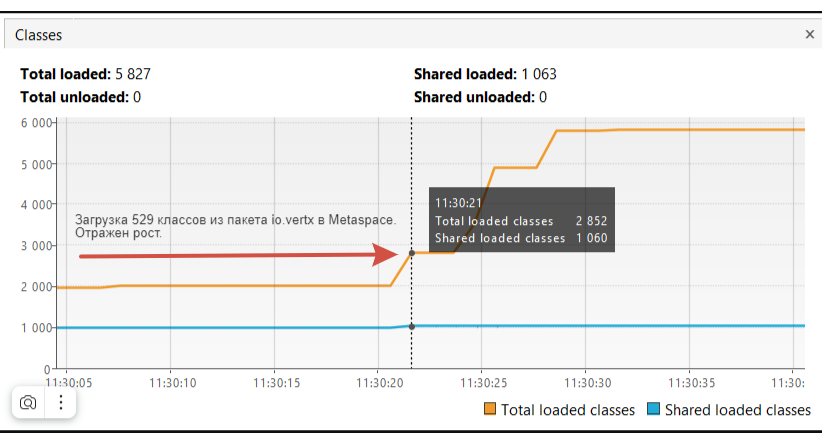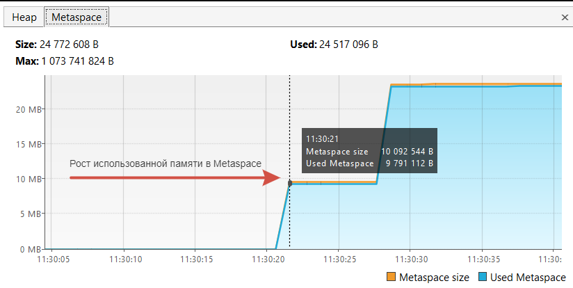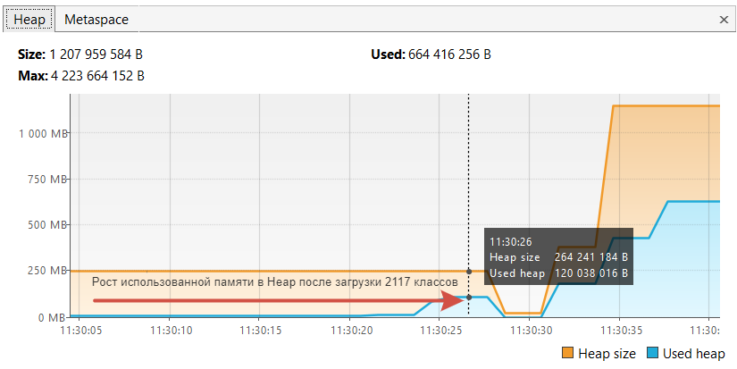

```
18:06:43.851698700: loading io.netty
18:06:44.453103600: loaded 2117 classes
```
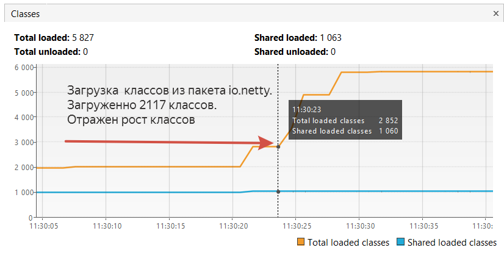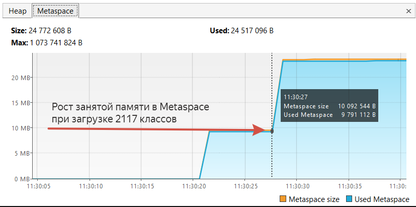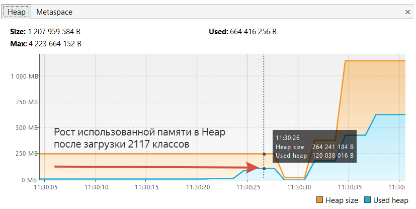

```
18:06:47.456572900: loading org.springframework
18:06:47.671412900: loaded 869 classes
```
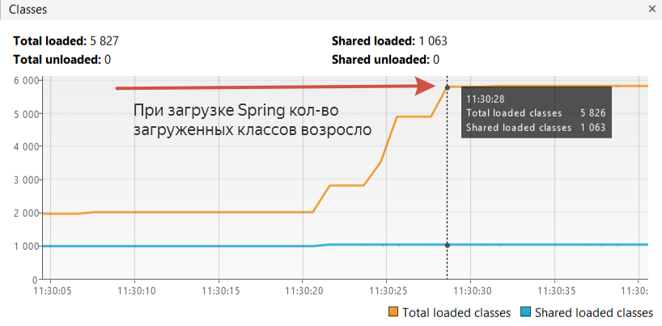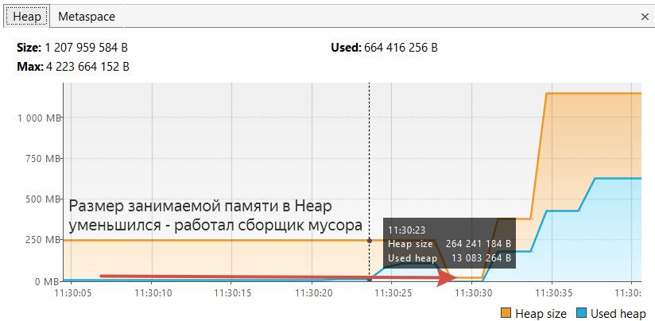

```
18:06:50.686040600: now see heap
18:06:50.687061200: creating 5000000 objects
18:06:51.017619200: created
```
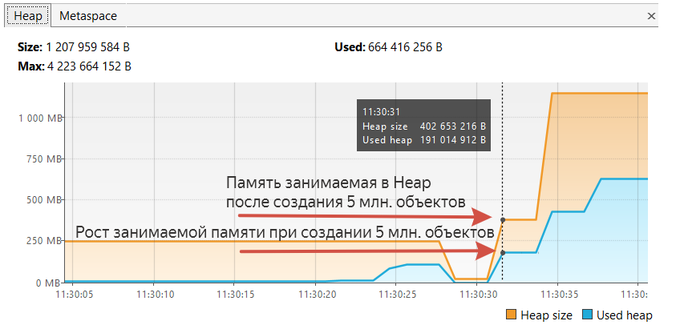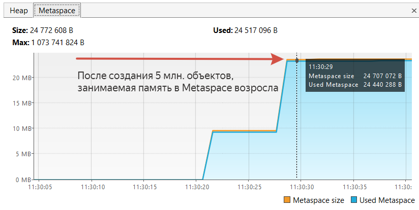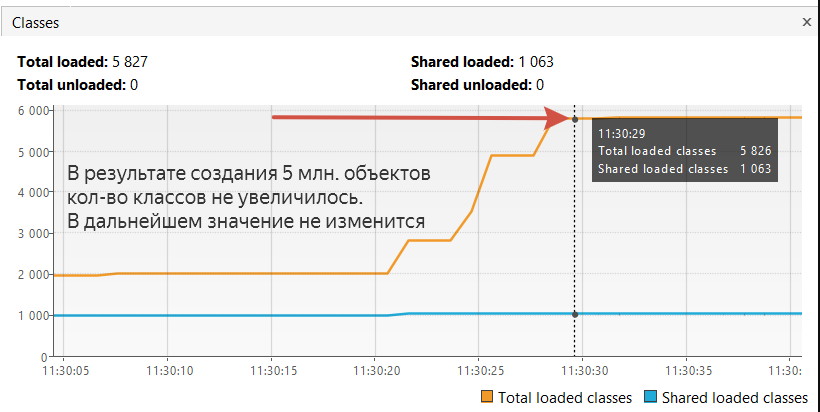

```
18:06:54.027263300: creating 5000000 objects
18:06:54.316110200: created
```
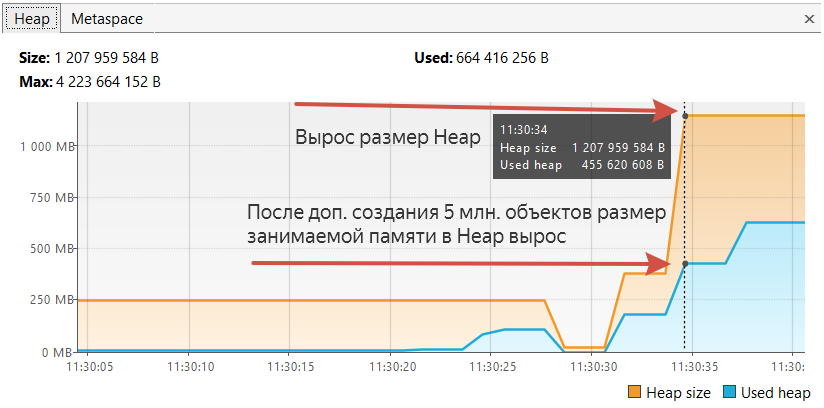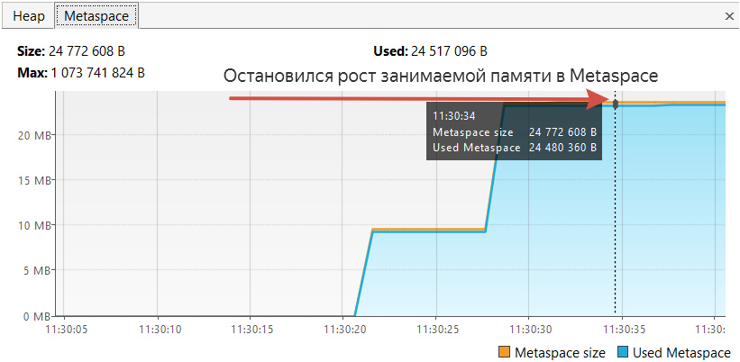

```
18:06:57.525387300: creating 5000000 objects
18:06:57.941897100: created

BUILD SUCCESSFUL in 55s
2 actionable tasks: 2 executed
18:07:01: Task execution finished 'JvmExperience.main()'.
```
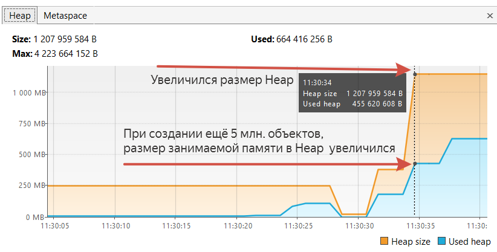

Программа завершила работу.


